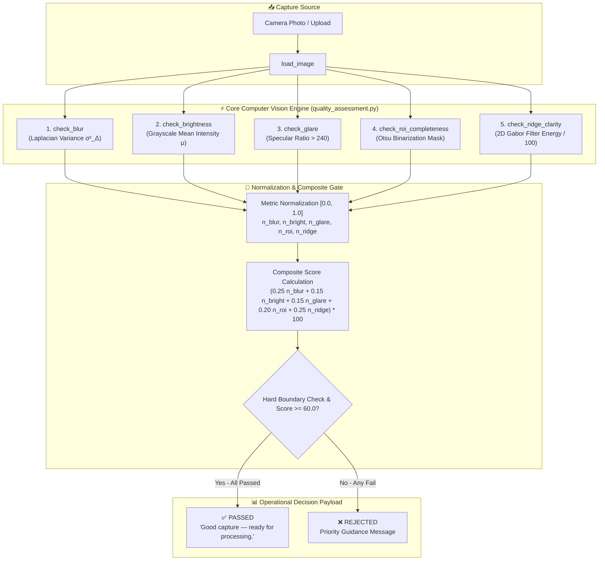
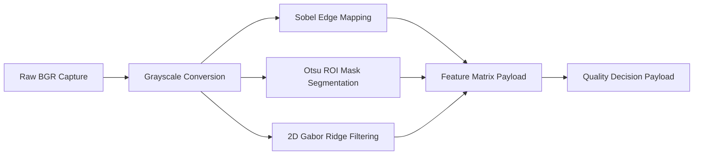

# FingerVision • Contactless Fingerprint Quality Assessment System


Production-grade, enterprise contactless fingerprint quality control software platform developed for **Assignment 4: Contactless Fingerprint Quality Assessment & Scoring Pipeline**.

---

## 📐 System Architecture Diagram



---

## 🔬 Computer Vision Metric Pipeline



---

## ⚡ Metric Specification & SLA Performance Budgets

| Metric | Algorithm / Operator | Default Threshold | Target SLA | Rejection Criteria |
| :--- | :--- | :---: | :---: | :--- |
| **Spatial Blur** | 2D Laplacian Operator Variance ($\sigma^2_{\Delta}$) | `10.0` | `< 10 ms` | Variance $< 10.0$ |
| **Luminance Balance** | Global Arithmetic Pixel Mean ($\mu$) | `[50.0, 210.0]` | `< 5 ms` | Mean $< 50.0$ (Dark) or $> 210.0$ (Bright) |
| **Specular Glare** | Overexposed Pixel Fraction ($I > 240$) | `0.05` | `< 10 ms` | Fraction $> 0.05$ |
| **ROI Completeness** | Gaussian Blur + Otsu Binarization Mask | `0.15` | `< 100 ms` | Foreground Ratio $< 0.15$ |
| **Ridge Clarity** | 2D Gabor Filter Bank ($21 \times 21, \theta=\pi/4, \lambda=10$) | `15.0` | `< 150 ms` | Response Variance $/ 100.0 < 15.0$ |
| **Total Pipeline** | Master Coordinator (`quality_gate()`) | `60.0` | **`< 300 ms`** | Composite $< 60.0$ or any Hard Failure |

---

## 📂 Project Directory Structure

```
contactless-fingerprint-qc/
├── quality_assessment.py     # CORE LAYER — 5 metrics + quality_gate()
├── quality_app.py            # PRESENTATION LAYER — Streamlit Master App
├── ui/                       # PRESENTATION MODULES
│   ├── __init__.py
│   ├── theme.py              # Emerald Glassmorphism CSS & Color Tokens
│   ├── components.py         # Base64 SVG Logo Engine, Timeline & Cards
│   └── charts.py             # Interactive Plotly Analytics Charts
├── test_quality.py           # CORE LAYER — Batch Verification Suite
├── generate_test_dataset.py  # Realistic Human Fingerprint Dataset Generator
├── generate_report.py        # ReportLab PDF Report Generator
├── requirements.txt        # Package Dependencies
├── README.md               # Visual Repository Documentation
├── test_dataset/           # 20 Realistic Human Fingerprint Captures
│   ├── good/               # 5 x Good Quality Human Captures (PASS)
│   ├── blurry/             # 5 x Blurry Human Captures (is_blurry=True)
│   ├── dark/               # 5 x Dark/Bright Human Captures (too_dark/too_bright=True)
│   └── glare/              # 5 x Glare Human Captures (has_glare=True)
└── report.pdf              # Assignment Technical Report (PDF)
```

---

## 🚀 Quick Start Guide

### 1. Clone Repository & Install Dependencies
```bash
git clone https://github.com/Kathitavan/YellowSence-Assignment.git
cd YellowSence-Assignment
pip install -r requirements.txt
```

### 2. Generate Human Test Captures
```bash
python generate_test_dataset.py
```

### 3. Run Automated Batch Evaluation
```bash
python test_quality.py
```

### 4. Launch Web Application Dashboard
```bash
streamlit run quality_app.py
```

---

## 📜 License & Compliance
Developed for **YellowSense Technologies Assignment 4**. Built strictly according to assignment reference code specifications.
